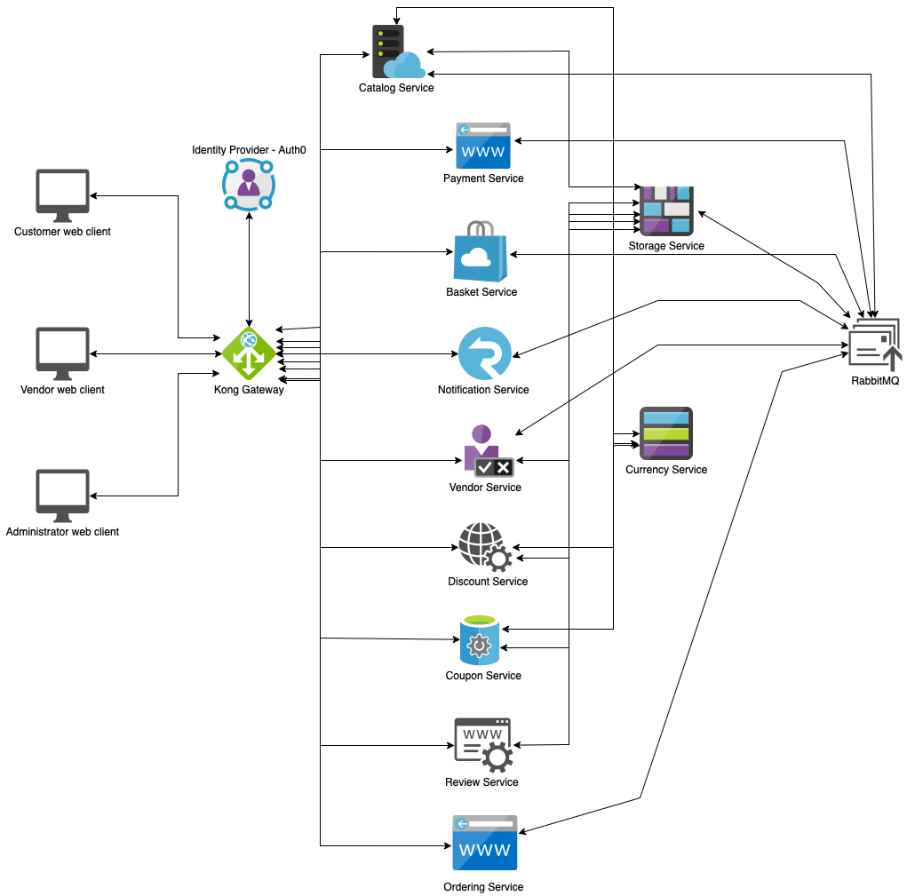

# eShop

An e-commerce application applying micro-services architecture.

## Services

| Name                 | Framework                                                                                                    | Database                                                                                                                                                                                                                                                       |
| -------------------- | ------------------------------------------------------------------------------------------------------------ | -------------------------------------------------------------------------------------------------------------------------------------------------------------------------------------------------------------------------------------------------------------- |
| Catalog Service      |  |                                                                                                            |
| Basket Service       |  |   |
| Payment Service      |  |                                                                                                                                            |
| Notification Service |               |                                                                                                                                                 |
| Vendor Service       |  |                                                                                                            |
| Discount Service     |  |                                                                                                            |
| Coupon Service       |  |                                                                                                            |
| Ordering Service     |               |                                                                                                            |
| Review Service       |  |                                                                                                            |
| Storage Service      |  |                                                                                                            |
| Currency Service     |  |                                                                                                            |

## Front-ends

| Name                    | Technology                                                                                                                                                                                                                                                                                                                                                                                                                                                                    |
| ----------------------- | ----------------------------------------------------------------------------------------------------------------------------------------------------------------------------------------------------------------------------------------------------------------------------------------------------------------------------------------------------------------------------------------------------------------------------------------------------------------------------- |
| Customer web client     |              |
| Vendor web client       |                                                                                                                                |
| Adminstrator web client |      |

## Others

| Name                        | Technology                                                                                                   |
| --------------------------- | ------------------------------------------------------------------------------------------------------------ |
| API Gateway                 | Kong Gateway                                                                                                 |
| Async Communication (M2M)   | RabbitMQ                                                                                                     |
| Sync Communication (M2M)    | gRPC                                                                                                         |
| Identity Provider           | Auth0                                                                                                        |
| Payment                     | Stripe                                                                                                       |
| CI/CD Pipeline              |  |
| Storage and Shared Database |    |

## Architecture

